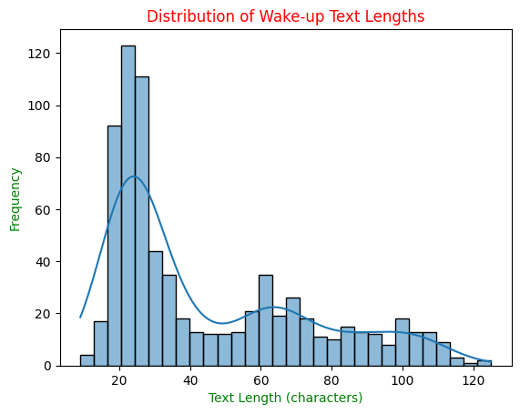

# Hello Nisha (Python + Anaconda + HuBERT + MLP)

Nisha Wake-Up Detection Dataset & Training a CRNN.  
In this project, I’m using the `.psv` (pipe-separated values) format, where a pipe (`|`) acts as the separator.  
A key design choice is the use of **ARPABET phonetic transcriptions**, which exponentially improves alignment and model accuracy by providing precise, standardized pronunciations—especially for critical words like *NISHA*.  


---

## Overview

This project is focused on building a **wake-up word detection system** for my personal assistant, Nisha. The goal is to ensure that Nisha can **accurately detect the wake-up phrase** while ignoring all irrelevant background conversations.


# Data Collection (text data)
## Dataset Structure

The dataset is carefully curated and split into two categories:

* **Positive Samples:**

  * Audio clips where the wake-up command (e.g., "Hello Nisha", "Hey Nisha") is spoken.
  * These examples train the model to recognize when it should respond.
  * [Positive Dataset](data/positive_mapping.psv)

* **Negative Samples:**

  * Audio clips of normal conversations that do **not** contain wake-up commands.
  * These examples help the model **ignore casual chatter** and reduce false positives.
  * [Negative Dataset](data/negative_mapping.psv)

### Example dataset Structure

<!-- ```md
text|voice1|voice2|voice3|label
Hello Nisha|001_Hello_Nisha.mp3|001_Hello_Nisha.mp3|001_Hello_Nisha.mp3|1
I can’t find my keys|neg_001_I_cant_find_my_keys.mp3|neg_001_I_cant_find_my_keys.mp3|neg_001.mp3|0
``` -->
<table>
  <tr>
    <th style="color:lightgreen;">text</th>
    <th style="color:white;">voice1</th>
    <th style="color:#ADD8E6;">voice2</th>
    <th style="color:#7f8282;">voice3</th>
    <th style="color:#12121;">.....</th>
    <th>label</th>
  </tr>
  <tr>
    <td style="color:lightgreen;">Hello Nisha</td>
    <td style="color:white;">001_Hello_Nisha.mp3</td>
    <td style="color:#ADD8E6;">001_Hello_Nisha.mp3</td>
    <td style="color:#7f8282;">001_Hello_Nisha.mp3</td>
    <td style="color:#12121;">.....</td>
    <td style="color:pink;">1</td>
  </tr>
  <tr>
    <td style="color:lightgreen;">I can’t find my keys</td>
    <td style="color:white;">neg_001_I_cant_find_my_keys.mp3</td>
    <td style="color:#ADD8E6;">neg_001_I_cant_find_my_keys.mp3</td>
    <td style="color:#7f8282;">neg_001_I_cant_find_my_keys.mp3</td>
    <td style="color:#12121;">.....</td>
    <td style="color:pink;">0</td>
  </tr>
</table>

* `label=1` → Positive (wake-up)
* `label=0` → Negative (background conversation)

# Example graph for Text length distribution




[click here to see the graph](graphs/text_length_distribution.png)

### 🔹 A big peak around 17-27 characters → means most sentences are medium-length greetings or general conversations like “Hello Nisha, how are you doing today?”

### 🔹 What the graph is?

It’s a **histogram** (with KDE curve if enabled) that shows how many of your wake-up sentences fall into different ranges of length.

* **X-axis** → the **length of the text** (in characters).

  * e.g., `"Nisha"` = 5 characters
  * `"Hello Nisha, how are you?"` ≈ 27 characters

* **Y-axis** → the **frequency** (how many sentences have that length).

* The **bars** → show counts of texts within that range.

* The **smooth KDE curve** (if shown) → estimates the probability distribution (a smoothed line over the bars).

---

# #Data creation (audio data)
## How MP3 Files Are Created for Nisha's Wake-Up System

This section explains, in simple terms, how the system generates MP3 files for Nisha, including a bit of technical workflow for context.

## 1. Overview

The system converts text sentences into MP3 audio files using multiple voices automatically, so you don't have to record each sentence manually. It uses Microsoft Edge TTS for [voice generation](Audio_generatoin/continuous_generation.py).

## 2. Step-by-Step Workflow

1. **Load all text data**

   * [The program](Audio_generatoin/continuous_generation.py) reads the dataset containing all the sentences that need to be spoken.
   * Example: `df = pd.read_csv("data/Negative_long_wakeup_dataset.psv", sep="|")`

2. **Fetch available voices**

   * Reads the [edge_tts.psv](Audio_generatoin/egde_tts.psv)
 file to get all the voices available for TTS.
   * Stores them in a list for processing.
   * Example:

     ```python
     voices_df = pd.read_csv("Audio_generatoin/egde_tts.psv", sep = "|")
     voices_list = voices_df["voices"].str.strip().tolist()
     ```

3. **Asynchronous communication with Edge TTS**

   * For each sentence and each voice, the system asynchronously sends the text to Edge TTS.
   * Edge TTS generates the audio and saves it as an MP3 file.
   * Skips any files that already exist to save time.

4. **Organize and save MP3 files**

   * Each voice has its own folder.
   * Filenames are sanitized and zero-padded for easy tracking.
   * Example filename: `001_Hello_Nisha.mp3` & `002_Weak_up_Nisha.mp3`


## 4. Audio creation Summary

The script automatically converts all text sentences into audio files using multiple voices, handling the process asynchronously and efficiently. This ensures that hundreds of audio clips can be generated quickly without manual recording.
(It is very time taking....)

---

# I need to install the libraries this way:
#### Because in my virtual env there are no space is left.
 ```bash
 TMPDIR=~/tmp_hello_nisha pip install torch torchaudio torchvision
```
# #Pre-processing steps: (using Anaconda + MFA)

## 1. Active the MFA Environment.
```bash
conda activate mfa_env
```
## 2. Next create the ARPABET Phonetic:
```bash
mfa g2p \
    /home/ranjit/Desktop/projects/Hello_Nisha/corpus_for_mfa/1_unique_words_mfa_ready.txt \
    english_us_arpa \
    /home/ranjit/Desktop/projects/Hello_Nisha/corpus_for_mfa/1_unique_words_mfa_ready.txt
```

## Output: [click here](data/1_local_lexicon.txt)
```
NISHA           N IY SH AA
NISHA           N IY SH AH
NISHA           N IH SH AA
NISHA           N IH SH AH
NISHA           N IHH SH AA
NISHA           N IIH SH AA
able            AH0 B AH0 L
able	        EY1 B AH0 L
active	        AE1 K T IH0 V
acting	        AE1 K T IH0 NG
activity	    AE0 K T IH1 V AH0 T IY0
activity	    AE0 K T IH1 V IH0 T IY0
activities	    AE0 K T IH1 V AH0 T IY0 Z
```
## 3. Create the alignments of `.wav` files with `.lab` :
```bash
mfa align \
  /home/ranjit/Desktop/projects/Hello_Nisha/corpus_for_mfa \
  /home/ranjit/Desktop/projects/Hello_Nisha/corpus_for_mfa/1_local_lexicon.txt \
  english_us_arpa \
  /home/ranjit/Desktop/projects/Hello_Nisha/corpus_for_mfa/aligned \
  --clean \
  --verbose
```
## Output: [click here](data/001_Hey_did_you_finish_that_homework_yet.TextGrid)


## 4. See the analysis Report: [click here](data/alignment_analysis.csv)


